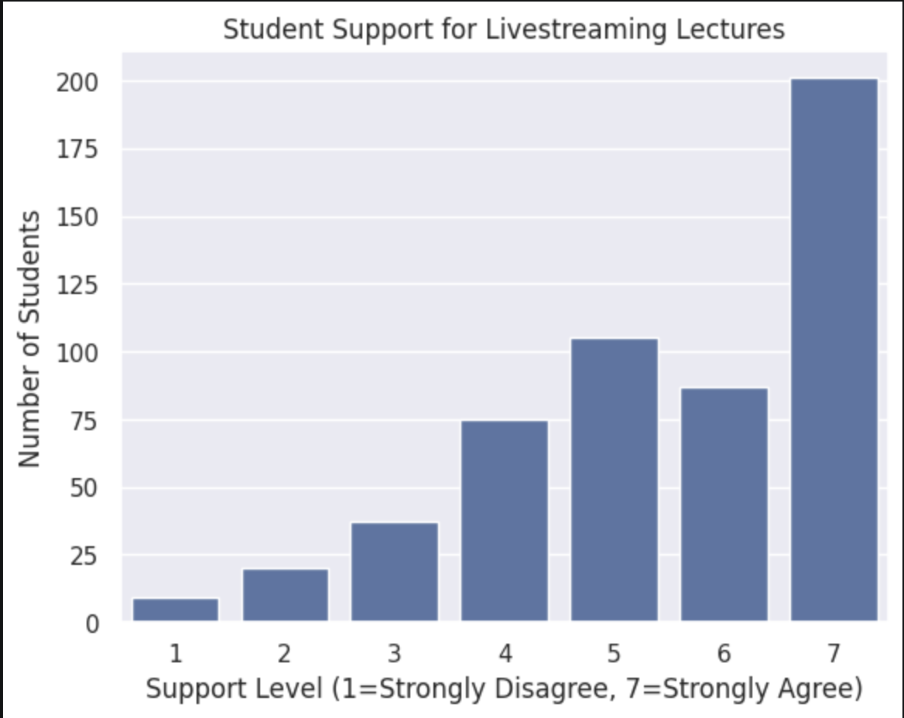
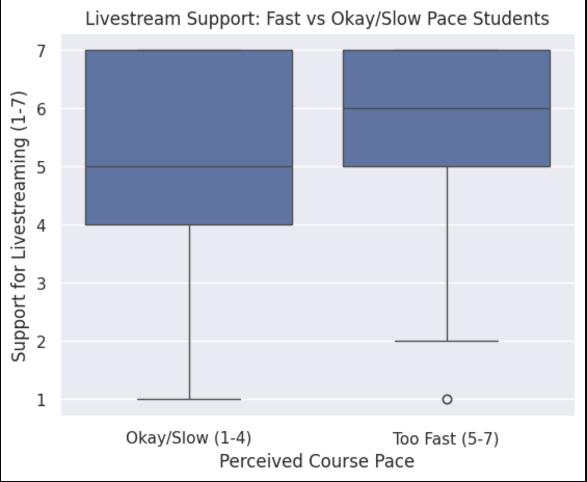
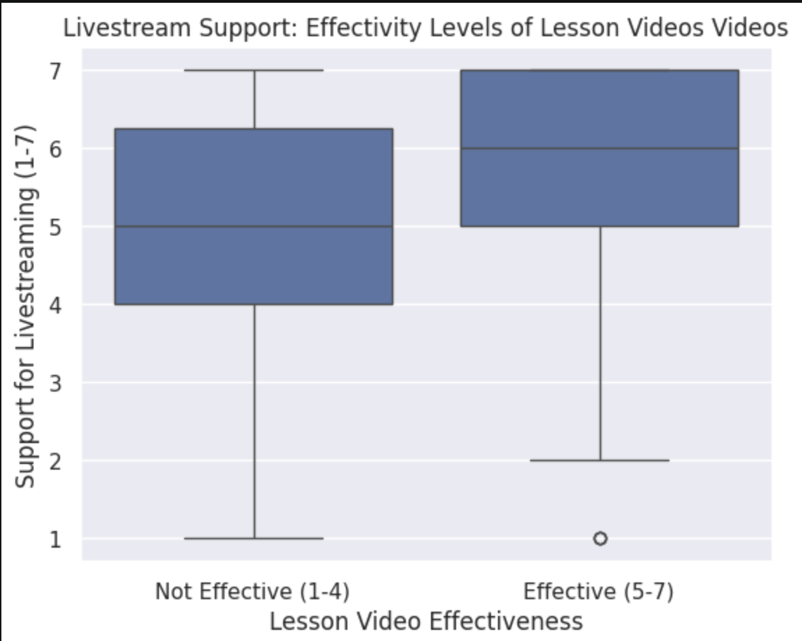

---
# Do not edit the text between these lines!
layout: default
---

# Data Analysis for Continuous Improvement: Livestreaming Lectures
**Author:** Josue Garcia-Lopez (PID: 730880484)

## Idea Overview:
The following analysis explores whether COMP110 should livestream and post lectures online for students. The reason teh idea was chosen was the potential return value for students. It would eliminate a couple of issues students face such as falling behind due to being unable to attend lectures. Additionally, it would give the chance for students who are struggling to keep up or don't fully grasp concepts to go back and rewatch segments of the lecture and learn at their own pace. Futhermore,it has the most survey data that can be analyzed and would be the easiest to implement without having to alter the curriculum and structure of the course very much. 

---

## 4. Data Analysis

### Data Collection: 
The data was loaded from Izzi's survey CSV. The relevant scale columns were converted to integers and further narrowed down to three colmns for analysis. A helper function was developed that kept rows where the column's value meets or exceeds a threshold to narrow it down to only students who strongly support livestreaming. 

---

## Plot 1: Distribution of Livestream Support
Here I created a graph that shows the distribution of student responses to the add_livestream question to examine how strongly students feel about having lectures livestreamed.

## Plot 2: Livestream and Course Pace
Here I made a graph that illustrates students' opinions on whether they consider the course fast-paced and how likely these individuals are to support livestreaming, as they may be most inclined to rewatch them to keep up with the material.

## Plot 3: Livestream vs. Lesson Video Effectiveness

In this graph, I explore whether students who find lesson videos effective would also support livestreaming, indicating they would value being able to review content on their own time.

---

## 5. Conclusion
My analysis dived into whether COMP110 should start livestreaming lectures and post them online. The data that has been gathered from the surveys supports this idea. In Plot 1, it can be seen that 393 out of 534 students gave a score of 5 or higher, and 201 gave the maximum score of 7. In Plot 2, it showed a strong trend that students who find the course pace too fast are more likely to support livestreaming since it would provide the opportunity to rewatch content. For Plot 3, it can be seen that students who find video lessons effective are more likely to be in favor of wanting livestreaming, indicating that students who value video content would find livestreaming as a beneficial component of the course.

A potential cost of implementing this idea is that it could possibly require additional technical resources or TA effort. Additionally, if students know lectures will be recorded, it may provide less incentive to attend class, which could lower attendance and participation rates. Furthermore, if this idea is implemented, results and effectiveness could be graded based on how sections in the past performed without recorded lectures to see whether this idea should become a permanent component of this class. Overall, the data supports the idea that COMP110 should implement livestreaming lectures.

<!-- This is a comment. Below, you'll see code for inserting an image. To make this image appear, update <custom-path>. To add an image, save it inside the imgs folder of this repository. -->
